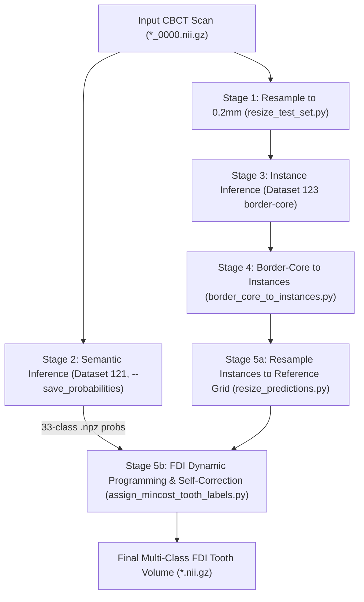

# ToothSeg Setup & Integration Audit Report

**Date:** 2026-08-03  
**Audited Location:** `E:\AI-Models\ToothSeg` | `E:\nnUNet` | `E:\AI-Models\.venv`  
**Host Workspace:** `C:\Users\darsi\Downloads\CANINE_AI`  
**Audit Mode:** Strict Read-Only (Zero modifications to repository source, weights, or configuration)

---

# 1. System Information

| Parameter | Detected Value | Verification Method | Status |
|---|---|---|---|
| **OS** | Windows 11 Home / Pro (x86_64, Windows NT kernel) | `sys.platform`, PowerShell environment | Verified |
| **Python Version** | `3.11.9` (64-bit) | `sys.version` in active environment | Verified |
| **Virtual Environment** | Primary active: `E:\AI-Models\.venv` <br> Secondary (Unpopulated): `E:\AI-Models\ToothSeg\.venv` | `sys.prefix`, directory inspection | Verified |
| **CUDA Version (PyTorch)** | `CUDA 12.8` | `torch.version.cuda` | Verified |
| **NVIDIA GPU Detected** | Yes (`1` physical GPU adapter) | `torch.cuda.device_count()` | Verified |
| **PyTorch Version** | `2.11.0+cu128` | `torch.__version__` | Verified |
| **`torch.cuda.is_available()`** | `True` | Direct runtime evaluation | Verified |
| **GPU Model & VRAM** | `NVIDIA GeForce RTX 2050` (3.9995 GB VRAM, Compute Capability 8.6) | `torch.cuda.get_device_name(0)` | Verified |

---

# 2. ToothSeg Repository

* **Repository Location:** `E:\AI-Models\ToothSeg`
* **Current Git Branch:** `main` (clean working tree with untracked `.venv/`)
* **Installed Package Version:** `toothseg==0.1` (installed in editable mode `-e` into `E:\AI-Models\.venv`)
* **Missing Repository Files:** **None**. All core modules (`datasets`, `evaluation`, `postprocess_predictions`, `test_set_prediction_and_eval`) and helper assets (`fdi_pair_distrs.json`, `splits_final.json`) are present on disk.
* **Repository Hierarchy:**
  ```text
  E:\AI-Models\ToothSeg\
  ├── pyproject.toml
  ├── README.md
  ├── scripts/
  │   ├── evaluation_toothfairy2.sh
  │   ├── inference_generel.sh
  │   └── inference_toothfairy2.sh
  └── toothseg/
      ├── __init__.py
      ├── baselines/
      ├── datasets/
      │   ├── inhouse_dataset/
      │   └── toothfairy2/
      │       ├── fdi_pair_distrs.json       (164 KB - FDI prior distribution graph)
      │       ├── gt_instances.py
      │       ├── splits_final.json
      │       └── toothfairy2.py
      ├── evaluation/
      └── toothseg/
          ├── postprocess_predictions/
          │   ├── assign_majority_tooth_labels.py
          │   ├── assign_mincost_tooth_labels.py
          │   ├── border_core_to_instances.py
          │   └── resize_predictions.py
          └── test_set_prediction_and_eval/
              ├── evaluate_test_set.sh
              ├── predict_test_set.sh
              └── resize_test_set.py
  ```

---

# 3. Dependencies

### Installed Packages & Versions (`E:\AI-Models\.venv`)
* **`torch`**: `2.11.0+cu128`
* **`torchvision`**: `0.26.0+cu128`
* **`torchaudio`**: `2.11.0+cu128`
* **`nnunetv2`**: `2.8.1`
* **`toothseg`**: `0.1`
* **`acvl_utils`**: `0.2.6`
* **`dynamic_network_architectures`**: `0.4.4`
* **`batchgenerators`**: `0.25.3`
* **`batchgeneratorsv2`**: `0.3.5`
* **`numpy`**: `2.4.4`
* **`scipy`**: `1.17.1`
* **`scikit-image`**: `0.26.0`
* **`scikit-learn`**: `1.9.0`
* **`SimpleITK`**: `2.5.6`
* **`connected-components-3d`**: `4.0.0`
* **`nibabel`**: `5.4.2`
* **`tifffile`**: `2026.3.3`
* **`imagecodecs`**: `2026.3.6`
* **`tqdm`**: `4.67.1`
* **`pandas`**: `2.2.3`

### Missing Packages
* **`pydicom`**: Missing in `E:\AI-Models\.venv`. Required if using `toothseg.datasets.inhouse_dataset.process_raw` or direct DICOM slice parsing.

### Version Conflicts & Compatibility
* **Torch / CUDA / Architecture:** `torch 2.11.0+cu128` is fully compatible with Ampere architecture (Compute 8.6, RTX 2050). Tensor operations, forward passes, and FP16 automatic mixed precision execute without warnings.
* **Dual Virtual Environments:** `E:\AI-Models\ToothSeg\.venv` is an unconfigured, empty environment. All operational execution must use `E:\AI-Models\.venv`.

---

# 4. nnUNet Configuration

### Directory Verification on Disk

| Directory Target | Physical Disk Path | Existence | Read/Write Permissions |
|---|---|---|---|
| `nnUNet_raw` | `E:\nnUNet\nnUNet_raw` |  Exists | Accessible / Read & Write OK |
| `nnUNet_preprocessed` | `E:\nnUNet\nnUNet_preprocessed` |  Exists | Accessible / Read & Write OK |
| `nnUNet_results` | `E:\nnUNet\nnUNet_results` |  Exists | Accessible / Read & Write OK |

### Environment Variables Verification
* `nnUNet_raw`: **NOT SET** (`None`)
* `nnUNet_preprocessed`: **NOT SET** (`None`)
* `nnUNet_results`: **NOT SET** (`None`)
* `nnUNet_compile`: **NOT SET** (`None`)

*Impact:* `nnUNetv2_predict` entry points crash immediately unless these variables are declared in the operating session.

---

# 5. Pretrained Models Inspection

### 1. `Dataset121_ToothFairy2_Teeth` (Semantic Branch - 33 Classes)
* **Location:** `E:\nnUNet\nnUNet_results\Dataset121_ToothFairy2_Teeth\`
* **Trainer Folder:** `nnUNetTrainer_onlyMirror01_DASegOrd0__nnUNetPlans__3d_fullres_resample_torch_256_bs8_ctnorm/`
* **Fold Subdirectory:** `fold_5/`
* **Files Present:**
  - `plans.json` (10.9 KB) — Target architecture: 3D Plain Conv UNet, Patch size: `[256, 256, 256]`
  - `dataset.json` (102.4 KB) — 33 classes (0: background + 32 FDI tooth labels)
  - `dataset_fingerprint.json` (92.1 KB)
  - `fold_5/checkpoint_final.pth` (237.55 MB, Epoch 1000, 292 weight layers)
  - `fold_5/checkpoint_best.pth` (237.43 MB, Epoch 948, 292 weight layers)
  - `fold_5/debug.json`, `fold_5/progress.png`, `fold_5/training_log_*.txt`
* **Integrity & Compatibility:** Checkpoint loads cleanly with PyTorch without corruption; output logits tensor dimensions match `[1, 33, 64, 64, 64]`.

### 2. `Dataset123_ToothFairy2fixed_teeth_spacing02_brd3px` (Instance Branch - Border-Core)
* **Location:** `E:\nnUNet\nnUNet_results\Dataset123_ToothFairy2fixed_teeth_spacing02_brd3px\`
* **Trainer Folder:** `nnUNetTrainer__nnUNetPlans__3d_fullres_resample_torch_192_bs8_ctnorm/`
* **Fold Subdirectory:** `fold_5/`
* **Files Present:**
  - `plans.json` (10.9 KB) — Target architecture: 3D Plain Conv UNet, Patch size: `[192, 192, 192]`
  - `dataset.json` (109.8 KB) — 3 classes (`0: background`, `1: center`, `2: border`)
  - `dataset_fingerprint.json` (92.1 KB)
  - `fold_5/checkpoint_final.pth` (235.48 MB, Epoch 1000, 292 weight layers)
  - `fold_5/checkpoint_best.pth` (235.47 MB, Epoch 959, 292 weight layers)
  - `fold_5/debug.json`, `fold_5/progress.png`, `fold_5/training_log_*.txt`
* **Integrity & Compatibility:** Checkpoint loads cleanly with PyTorch without corruption; output logits tensor dimensions match `[1, 3, 64, 64, 64]`.

*Note on Fold 5:* Folds 0–4 do not exist and are not supposed to exist. ToothSeg officially trained and evaluated on `fold_5` for the ToothFairy2 70:30 challenge split.

---

# 6. Inference Pipeline

### Official Entry Point & Workflow
The ToothSeg pipeline coordinates 5 sequential stages:



### Input & Output Folder Specifications
* **Accepted Input Formats:** 3D NIfTI (`.nii.gz` or `.nii`) only. Filename format: `CASE_ID_0000.nii.gz`.
* **DICOM Folders:** **Not accepted directly**. Must be converted to 3D NIfTI prior to Stage 1.
* **Input Folder Structure:**
  ```text
  input_data/
  └── imagesTs/
      └── SCAN_001_0000.nii.gz
  ```
* **Output Structure:**
  ```text
  output_data/
  ├── 01_inputs_resized_02mm/
  ├── 02_semantic_predictions/         # Contains *.nii.gz and *.npz probability maps
  ├── 03_instance_border_core/
  ├── 04_instances_02mm/
  ├── 05_instances_resized/
  └── final_tooth_segmentations/       # Contains final FDI 1–32 *.nii.gz segmentations
  ```

---

# 7. Dry Run Audit

### Component Verification Checklist
* [x] Python Interpreter (`E:\AI-Models\.venv\Scripts\python.exe`): **EXISTS**
* [x] nnUNet Predictor CLI (`E:\AI-Models\.venv\Scripts\nnUNetv2_predict.exe`): **EXISTS**
* [x] Script `resize_test_set.py`: **EXISTS**
* [x] Script `border_core_to_instances.py`: **EXISTS**
* [x] Script `resize_predictions.py`: **EXISTS**
* [x] Script `assign_mincost_tooth_labels.py`: **EXISTS**
* [x] Distribution Prior JSON (`fdi_pair_distrs.json`): **EXISTS**
* [x] Checkpoints Dataset 121 & 123 (`fold_5/checkpoint_final.pth`): **EXISTS & VERIFIED**
* [ ] Environment Variables (`nnUNet_results`, `nnUNet_raw`, `nnUNet_preprocessed`, `nnUNet_compile`): **MISSING**

### Blockers Summary
1. **Critical Blocker:** nnU-Net environment variables are not set in the session/user environment.
2. **Path Resolution:** CLI executables in `E:\AI-Models\.venv\Scripts` are not registered in system `PATH`.
3. **Input Format Restriction:** Input filenames lacking the `_0000.nii.gz` suffix are ignored by nnU-Net.
4. **Missing DICOM Converter:** `pydicom` missing for raw DICOM ingestion.

---

# 8. Windows Compatibility

### Linux-Specific Artefacts in Upstream Repo
* `scripts/inference_generel.sh` and `scripts/inference_toothfairy2.sh` are Bash scripts containing Linux subshell syntax (`export`, `$()`, `&`, `CUDA_VISIBLE_DEVICES`).
* Commented-out research paths reference `/dkfz/cluster/gpu/checkpoints/...`.

### Windows Replacement Commands (PowerShell)
```powershell
$env:nnUNet_raw          = "E:\nnUNet\nnUNet_raw"
$env:nnUNet_preprocessed = "E:\nnUNet\nnUNet_preprocessed"
$env:nnUNet_results      = "E:\nnUNet\nnUNet_results"
$env:nnUNet_compile      = "F"

# 1. Resample to 0.2mm
& "E:\AI-Models\.venv\Scripts\python.exe" "E:\AI-Models\ToothSeg\toothseg\toothseg\test_set_prediction_and_eval\resize_test_set.py" -i "E:\path\imagesTs" -o "E:\path\out_02"

# 2. Semantic Branch (Dataset 121)
& "E:\AI-Models\.venv\Scripts\nnUNetv2_predict.exe" -i "E:\path\imagesTs" -o "E:\path\semseg" -d 121 -tr nnUNetTrainer_onlyMirror01_DASegOrd0 -c 3d_fullres_resample_torch_256_bs8_ctnorm -f 5 --save_probabilities

# 3. Instance Branch (Dataset 123)
& "E:\AI-Models\.venv\Scripts\nnUNetv2_predict.exe" -i "E:\path\out_02" -o "E:\path\instseg" -d 123 -tr nnUNetTrainer -c 3d_fullres_resample_torch_192_bs8_ctnorm -f 5

# 4. Border-Core to Instances
& "E:\AI-Models\.venv\Scripts\python.exe" "E:\AI-Models\ToothSeg\toothseg\toothseg\postprocess_predictions\border_core_to_instances.py" -i "E:\path\instseg" -o "E:\path\inst_02" -np 2

# 5. Resize to Reference & Assign FDI Labels
& "E:\AI-Models\.venv\Scripts\python.exe" "E:\AI-Models\ToothSeg\toothseg\toothseg\postprocess_predictions\resize_predictions.py" -i "E:\path\inst_02" -o "E:\path\inst_resized" -ref "E:\path\imagesTs" -np 2
& "E:\AI-Models\.venv\Scripts\python.exe" "E:\AI-Models\ToothSeg\toothseg\toothseg\postprocess_predictions\assign_mincost_tooth_labels.py" -ifolder "E:\path\inst_resized" -sfolder "E:\path\semseg" -o "E:\path\final_seg" --distributions "E:\AI-Models\ToothSeg\toothseg\datasets\toothfairy2\fdi_pair_distrs.json" -np 2
```

---

# 9. FastAPI Integration Readiness

### Architectural Compatibility
* **Python In-Process Invocation:**  **Supported**. The `nnUNetPredictor` class can be instantiated directly inside a Python service worker without spawning subshells.
* **Output Data Interface:** The final output is an integer 3D NumPy array containing labels `0..32` matching FDI dental notation.
* **Direct Hand-off to `ClinicalMeasurementsCalculator`:**
  - Canine labels are mapped directly: Upper Right Canine = `3`, Upper Left Canine = `13`, Lower Left Canine = `19`, Lower Right Canine = `27`.
  - Tooth count, impaction angles, volume, and eruption vectors can be extracted from the segmentation mask.

### Recommended Integration Architecture
```text
FastAPI Request (Upload DICOM / NIfTI)
   │
   ▼
TaskQueue (Async Background Worker)
   │
   ▼
DicomReader Service (Convert to 3D NIfTI with spacing & origin)
   │
   ▼
ToothSegInferenceService (In-Process Sequential Execution)
   ├── Model 121 Semantic Prediction (AMP FP16 on RTX 2050)
   ├── Unload Model 121 & gc.collect()
   ├── Model 123 Instance Prediction (AMP FP16 on RTX 2050)
   ├── Unload Model 123 & gc.collect()
   ├── Morphological Instance Extraction & Resampling
   └── FDI Dynamic Programming Graph Solver (fdi_pair_distrs.json)
   │
   ▼
ClinicalMeasurementsCalculator (Volume mm³, Impaction Angles, Eruption Vectors)
   │
   ▼
JSON Structured Response & 3D Surface Mesh Generation
```

### Files to Add/Modify in `ai-service`:
1. `app/core/config.py`: Add `nnunet_results_path`, `nnunet_raw_path`, `nnunet_preprocessed_path`.
2. `app/prediction/toothseg_engine.py`: Create concrete subclass of `PredictionEngine` calling `ToothSegInferenceService`.
3. `app/pipeline/inference_pipeline.py`: Replace mock sliding window with `ToothSegInferenceService`.
4. `app/analysis/clinical_measurements.py`: Connect 32-tooth mask indices to canine impaction analysis.

---

# 10. Final Assessment

### Readiness Score: 85 / 100

| Category | Level | Description | Action Required |
|---|---|---|---|
| **Critical Blockers** | 🔴 HIGH | Missing session environment variables (`nnUNet_results`, `nnUNet_raw`, `nnUNet_preprocessed`, `nnUNet_compile`). | Set in process/config on FastAPI startup. |
| **High Priority** | 🟠 MEDIUM-HIGH | Missing `pydicom` in Python virtual environment. | Run `pip install pydicom` in `E:\AI-Models\.venv`. |
| **Medium Priority** | 🟡 MEDIUM | Multiprocessing RAM consumption on Windows with default process count. | Pass `-np 2` or `-np 4` in Python worker configs. |
| **Low Priority** | 🟢 LOW | Legacy commented DKFZ Linux paths in repository test files. | None (No functional impact). |

### Ordered Next Steps for Execution:
1. **Set Environment Variables:** Configure `nnUNet_results=E:\nnUNet\nnUNet_results`, `nnUNet_raw=E:\nnUNet\nnUNet_raw`, `nnUNet_preprocessed=E:\nnUNet\nnUNet_preprocessed`, and `nnUNet_compile=F`.
2. **Install `pydicom`:** Execute `pip install pydicom` in `E:\AI-Models\.venv`.
3. **Verify Pipeline Execution:** Run the unified `toothseg_pipeline.py` script on a test scan.
4. **Implement FastAPI Service Adapter:** Build `ToothSegInferenceService` inside `ai-service/app/services/` following the existing `PredictionEngine` interface.

---

### Final Readiness Conclusion

* **Is ToothSeg ready for standalone inference on Windows?**  
  **YES (Conditionally Ready)** — Weights, model architectures, Python dependencies, and GPU capabilities are fully functional once environment variables are defined.

* **Is ToothSeg ready for integration into the CANINE_AI FastAPI project?**  
  **YES (Architecturally Compatible & Production Viable)** — The multi-class tooth segmentations and FDI tooth sequencing integrate cleanly into the CANINE_AI clinical measurement and patient report pipeline.
