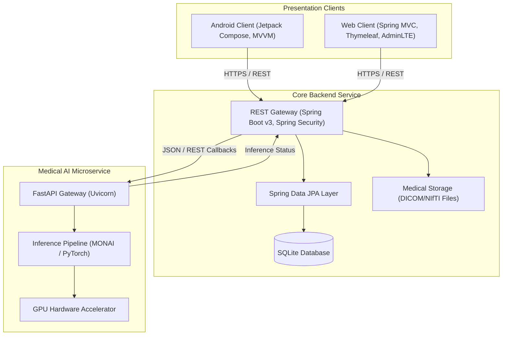
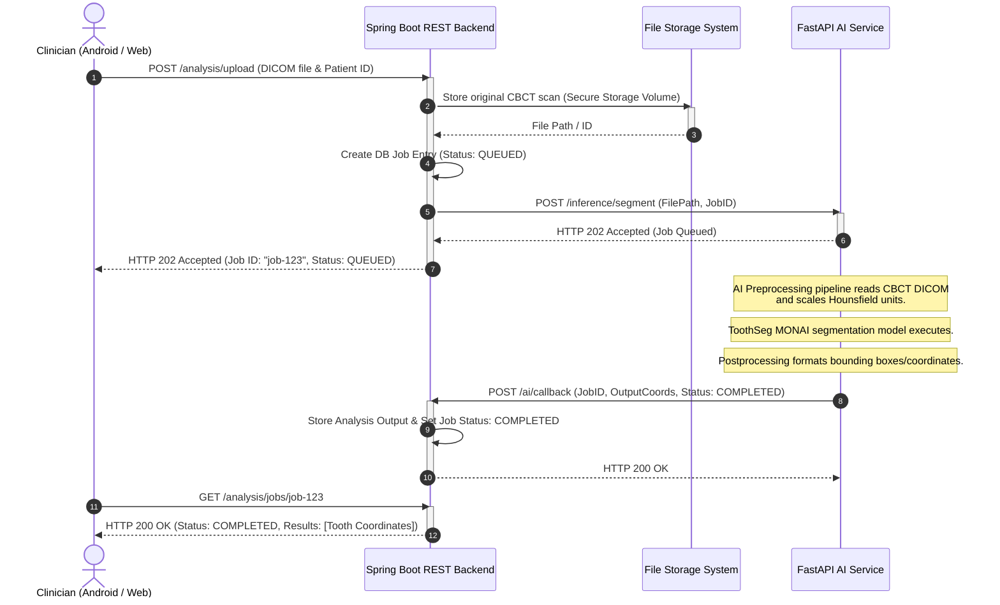
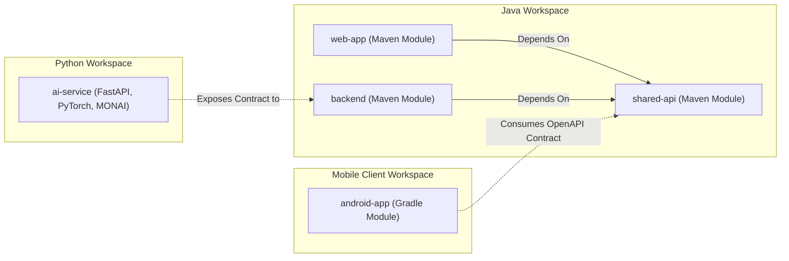

# CanineAI: Architecture Blueprint & Platform Foundation Specification

This document provides the complete structural specification, package organization, communication models, and operational strategies for **CanineAI**, an enterprise-grade AI-Assisted CBCT Dental Analysis Platform.

---

## 1. System Topology & Architecture Diagram

CanineAI uses a modular, decoupled architecture consisting of an **Android Client**, a **Web Client**, a central **Spring Boot REST Backend**, and a specialized **FastAPI AI Microservice** executing MONAI/PyTorch diagnostic pipelines.



---

## 2. Communication Diagram

The following sequence details the asynchronous dental analysis workflow: from scan upload to processing, segmenting via PyTorch/MONAI, and updating the client.



---

## 3. Dependency Diagram

The architectural relationships and dependencies among modules:



---

## 4. Project Folder Tree

```text
CanineAI/
├── android-app/
│   ├── gradle/
│   │   └── libs.versions.toml
│   ├── app/
│   │   ├── src/
│   │   │   └── main/
│   │   │       ├── java/com/canineai/android/
│   │   │       │   ├── di/
│   │   │       │   ├── data/
│   │   │       │   ├── domain/
│   │   │       │   └── presentation/
│   │   │       │       ├── components/
│   │   │       │       ├── navigation/
│   │   │       │       ├── theme/
│   │   │       │       ├── common/
│   │   │       │       ├── splash/
│   │   │       │       │   ├── screen/
│   │   │       │       │   ├── viewmodel/
│   │   │       │       │   ├── state/
│   │   │       │       │   ├── event/
│   │   │       │       │   ├── components/
│   │   │       │       │   └── navigation/
│   │   │       │       ├── auth/             [contains: screen, viewmodel, state, event, components, navigation]
│   │   │       │       ├── dashboard/        [contains: screen, viewmodel, state, event, components, navigation]
│   │   │       │       ├── patients/         [contains: screen, viewmodel, state, event, components, navigation]
│   │   │       │       ├── upload/           [contains: screen, viewmodel, state, event, components, navigation]
│   │   │       │       ├── analysis/         [contains: screen, viewmodel, state, event, components, navigation]
│   │   │       │       ├── reports/          [contains: screen, viewmodel, state, event, components, navigation]
│   │   │       │       ├── history/          [contains: screen, viewmodel, state, event, components, navigation]
│   │   │       │       ├── settings/         [contains: screen, viewmodel, state, event, components, navigation]
│   │   │       │       ├── profile/          [contains: screen, viewmodel, state, event, components, navigation]
│   │   │       │       └── notifications/    [contains: screen, viewmodel, state, event, components, navigation]
│   │   │       └── AndroidManifest.xml
│   │   └── build.gradle.kts
│   ├── build.gradle.kts
│   └── settings.gradle.kts
├── web-app/
│   ├── src/
│   │   └── main/
│   │       ├── java/com/canineai/webapp/
│   │       │   ├── config/
│   │       │   ├── controller/
│   │       │   ├── client/
│   │       │   └── dto/
│   │       └── resources/
│   │           ├── templates/
│   │           ├── static/
│   │           │   ├── css/
│   │           │   ├── js/
│   │           │   └── img/
│   │           ├── application.yml
│   │           ├── application-dev.yml
│   │           └── application-prod.yml
│   └── pom.xml
├── backend/
│   ├── src/
│   │   └── main/
│   │       ├── java/com/canineai/backend/
│   │       │   ├── config/
│   │       │   ├── security/
│   │       │   ├── controller/
│   │       │   ├── service/
│   │       │   ├── repository/
│   │       │   ├── model/
│   │       │   ├── dto/
│   │       │   ├── exception/
│   │       │   ├── storage/
│   │       │   ├── audit/
│   │       │   ├── notification/
│   │       │   ├── validation/
│   │       │   ├── mapper/
│   │       │   ├── utils/
│   │       │   ├── constants/
│   │       │   └── common/
│   │       └── resources/
│   │           ├── application.yml
│   │           ├── application-dev.yml
│   │           └── application-prod.yml
│   └── pom.xml
├── ai-service/
│   ├── app/
│   │   ├── api/
│   │   ├── core/
│   │   ├── preprocessing/
│   │   ├── segmentation/
│   │   ├── analysis/
│   │   ├── postprocessing/
│   │   ├── inference/
│   │   ├── services/
│   │   ├── models/
│   │   ├── utils/
│   │   ├── middleware/
│   │   ├── exceptions/
│   │   ├── schemas/
│   │   ├── config/
│   │   └── logging/
│   ├── Dockerfile
│   └── requirements.txt
├── shared-api/
│   ├── src/
│   │   └── main/
│   │       └── resources/openapi/
│   │           └── canineai-spec.yaml
│   └── pom.xml
├── deployment/
│   ├── docker-compose.yml
│   ├── Dockerfile.backend
│   ├── Dockerfile.webapp
│   └── .env.example
├── assets/
├── reports/
├── trained-models/
├── samples/
├── pom.xml
├── .gitignore
└── README.md
```

---

## 5. Module Responsibilities

### 5.1 Backend Module (`backend/`)
Core API server orchestrating data persistence, authorization, storage, and AI jobs.
- **`config/`**: System-wide bean, CORS, and spring profiles setups.
- **`security/`**: JWT filter pipeline, request authentication, and access controllers.
- **`controller/`**: Exposes REST interfaces matching the OpenAPI specification.
- **`service/`**: Coordinates transactional domain business logic.
- **`repository/`**: Interfaces Spring Data JPA repositories interacting with SQLite.
- **`model/`**: JPA entity mappings defining DB storage.
- **`dto/`**: Request/Response wrapper definitions.
- **`exception/`**: Global REST exception handlers and custom medical domain error classes.
- **`storage/`**: DICOM/NIfTI raw volume file upload handling and directory management.
- **`audit/`**: Secure clinical action loggers tracking HIPAA-compliant events.
- **`notification/`**: Push notifications and system alerts manager.
- **`validation/`**: Custom clinical data validators (e.g., matching medical file headers).
- **`mapper/`**: MapStruct structures converting Domain Model Entities to DTOs.
- **`utils/`**: Shared string, geometry, and utility helpers.
- **`constants/`**: Global system states, roles, and schema metadata variables.
- **`common/`**: Reusable generic domain wrappers and paginators.

### 5.2 Medical AI Service Module (`ai-service/`)
FastAPI microservice executing inference pipelines on dental volumetric scans.
- **`api/`**: Uvicorn endpoint routes for incoming inference calls.
- **`core/`**: Microservice base settings and hardware (CPU/GPU) state managers.
- **`preprocessing/`**: Transforms input CBCT scans (spacing rescaling, Hounsfield Unit window scaling, resizing).
- **`segmentation/`**: Neural network layer components implementing ToothSeg/MONAI segmentation algorithms.
- **`analysis/`**: Diagnostic logic localization (e.g., measuring maxillary canine eruption angles).
- **`postprocessing/`**: Cleanup filters (e.g., removing noise via Connected Component Analysis, mesh output formatting).
- **`inference/`**: Torch inference loops utilizing GPU accelerators with mixed precision caching.
- **`services/`**: Coordinates workflow orchestrations (fetching files, triggering jobs, calling back backend).
- **`models/`**: Pydantic database models and settings classes.
- **`utils/`**: File conversion (DICOM to NIfTI) and math operation utilities.
- **`middleware/`**: Request timeout monitoring and medical payload limits checker.
- **`exceptions/`**: AI pipeline specific exceptions (e.g., input scan corrupted).
- **`schemas/`**: Strict JSON schemas defining parameters for internal pipelines.
- **`config/`**: Microservice environment configurations.
- **`logging/`**: Thread-safe performance telemetry and model accuracy metric logs.

### 5.3 Android App Module (`android-app/`)
Mobile native frontend utilizing Compose and MVVM clean architecture layers.
- **`di/`**: Hilt modules supplying singletons for storage, network clients, and repositories.
- **`data/`**: Room database, local cache, Retrofit clients, and repository implementations.
- **`domain/`**: Pure Kotlin business layer defining interfaces and interactors.
- **`presentation/`**: Feature-first divided presentation structures (e.g., `analysis/`, `patients/`):
  - **`screen/`**: Composable UI views representing layout configurations.
  - **`viewmodel/`**: Android Architecture Components lifecycle ViewModels holding state.
  - **`state/`**: Immutable UI states representing progress, errors, or results.
  - **`event/`**: Sealed classes defining unidirectional user interactions.
  - **`components/`**: Feature-specific sub-layouts and UI atoms.
  - **`navigation/`**: Feature destination routes mapping in Navigation Compose graphs.

---

## 6. Development & Operational Strategies

### 6.1 Coding & Naming Standards
- **Java**: Follow Google Java Style Guide. Standard camelCase for functions and variables. PascalCase for classes.
- **Kotlin**: Follow official Kotlin Style Guide. Use sealed interfaces for state events. ViewModels should expose read-only flows (`StateFlow`).
- **Python**: Follow PEP 8 guidelines. Type hint all FastAPI route functions. Use standard `snake_case` for variables, modules, and functions.

### 6.2 Git & Branching Strategy
We use GitFlow for platform updates:
- **`main`**: Production deployment releases only.
- **`develop`**: Master development branch containing reviewed code.
- **`feature/canine-{issue}`**: Sandbox branches targeting isolated features.
- **`hotfix/canine-{issue}`**: Live production security patches.

### 6.3 Environment Configuration Strategy
- **Development**: Environment variables declared in local `.env` and Spring `application-dev.yml` files. Backend targets local SQLite database file.
- **Production**: Deployment containers read values from orchestration engines. Run processes using safe `non-root` runtimes.

### 6.4 API Versioning Strategy
- Explicit version paths inside URL strings: `/api/v1/...`
- Breaking payload changes trigger a path increment (`/v2/...`).

### 6.5 Security Strategy
- **Authentication**: JWT based. Bearer tokens must contain standard claims (role, expiration).
- **Data Protection**: Medical scans processed over HTTPS. Storage volumes encrypted at rest.
- **Microservices**: Network security groups isolate Python AI inference engines behind the backend gateway.

### 6.6 Error Handling Strategy
- **Backend API**: Global `@RestControllerAdvice` translates platform failures into a standard `ResponseWrapper` JSON object with HTTP error codes.
- **FastAPI AI**: Domain exceptions catch GPU out-of-memory or file reading failures, executing fallback actions and posting failure details to the callback endpoint.

### 6.7 Logging and Audit Logging Strategy
- Core events (user logins, scan uploads, diagnostic outputs) trigger transactional DB logs for HIPAA audits.
- Telemetry engines scrape stdout/stderr streams outputting JSON logs in production.
